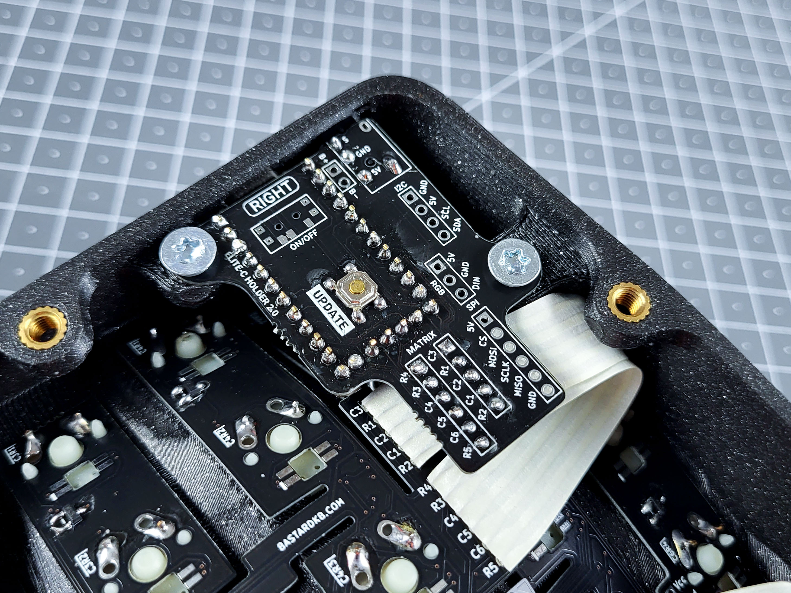
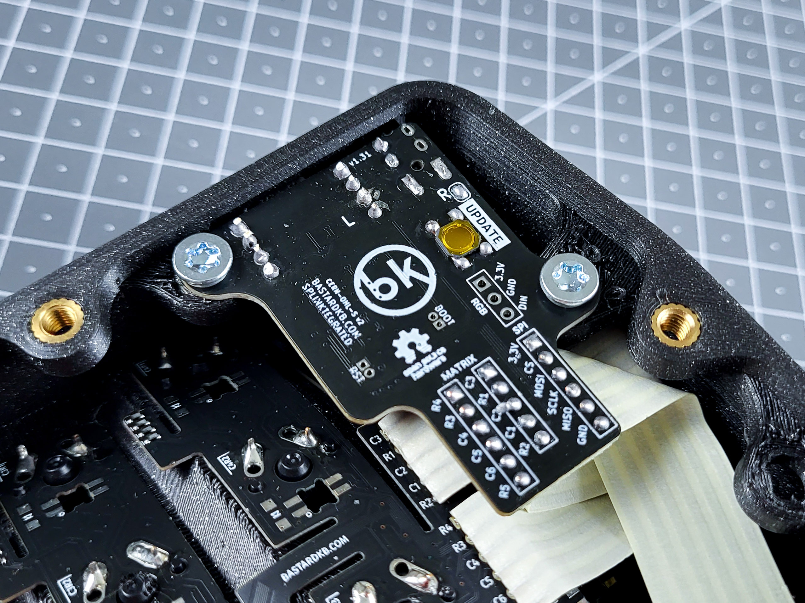

# Bastard Keyboards firmwares

This repository contains the firmware code and releases for the Bastard Keyboards Charybdis boards, including builds for Splinky (and RP2040-based controllers implementing the BKB standard pinout, _eg._ Splinky, Elite-Pi, etc…), Blackpill, STeMCell, and Elite-C (legacy AVR controller).

While this repository is used as primary source of truth for Bastard Keyboards firmwares, as it contains the latest changes and improvements, the maintainers aim at upstreaming all those changes to the official [QMK repository](https://github.com/qmk/qmk_firmware).

# Getting Started

The following section will guide you through downloading and installing the proper firmware on your Bastard Keyboard.

## Releases

The latest releases of the firmware are available in the [Releases](https://github.com/Bastardkb/bastardkb-qmk/releases/) section.

The format of the firmware file name is:

```
bastardkb_{keyboard}_vendor.uf2
```

`vendor` refers to the keymap. This keymap is available for all boards and comes preflashed when ordering a kit or a prebuilt from the shop. For some keyboards (namely, those with a 3x5 form factor), the [Miryoku](https://github.com/manna-harbour/miryoku) keymap is also available for download.

The `vendor` keymap is compatible out-of-the-box with [Via](https://usevia.app).

`{keyboard}` corresponds to the physical keyboard, and optionally to the controller, for which you are looking to download the firmware for.

### Dilemma & Dilemma Max

The **Dilemma** and the **Dilemma Max** both have the controller built in, so `{keyboard}` is one of the following:

- `dilemma_3x5_3`: the 3x5+3 [Dilemma](https://github.com/bastardkb/dilemma/)
- `dilemma_4x6_4`: the 4x6+4 [Dilemma Max](https://github.com/bastardkb/dilemma/)

### Dilemma 3x5+2

The firmware for the **Dilemma 3x5+2** is not available for download, and must be built manually. See [Building from source (advanced)](#building-from-source-advanced) for more information.

### Charybdis and Dactyls

`{keyboard}` corresponds to the physical keyboard you are looking the firmware for. It can be one of the following:

- `skeletyl`: the 3x5+3 [Skeletyl](https://github.com/Bastardkb/Skeletyl/)
- `tbkmini`: the 3x6+3 [TBK Mini](https://github.com/Bastardkb/TBK-Mini/)
- `scylla`: the 4x6+5 [Scylla](https://github.com/Bastardkb/Scylla)
- `charybdis_3x5`: the 3x5+3 [Charybdis Nano](https://github.com/bastardkb/charybdis/)
- `charybdis_3x6`: the 3x6+3 [Charybdis Mini](https://github.com/bastardkb/charybdis/)
- `charybdis_4x6`: the 4x6+5 [Charybdis](https://github.com/bastardkb/charybdis/)

If you have any doubts, feel free to reach out for help on the [Discord](https://bastardkb.com/discord).

## Installing the keymap

The process of installing the keymap on the keyboard is called "flashing". For kits and prebuilts, the process is straightforward:

1. Download the firmware file (see [Releases](#releases) section)
1. Physically disconnect your keyboard (both host-to-keyboard USB cable, and keyboard halves TRS/TRRS cable)
1. Plug in one half of the keyboards
1. Double-press the `reset` button on your controller; a new mass-storage device will be reported by the host computer (just as a USB key)
1. Drag & drop the firmware file at the root of this device; once copied, the device is automatically ejected
1. Physically disconnect the first half, and plug in the other one
1. Repeat the steps to flash the second half
1. Physically disconnect the second half

The new firmware is now installed on both halves. Connect the two halves with the TRS/TRRS cable, and connect one half to the PC/Mac.

If you have any questions, feel free to reach out for help on the [Discord](https://bastardkb.com/discord).

## Via

[Via](https://usevia.app) is an open-source cross-platform (Windows, Linux and Mac) GUI for QMK powered keyboards for configuring your keymap in real time.


It is compatible with the `via` keymaps that can be downloaded from the [Releases](https://github.com/Bastardkb/bastardkb-qmk/releases/) section.

Steps to use Via:

1. [Open Via](https://usevia.app) from their website, install and open the application
1. Plug your keyboard in
1. PC/Mac will detect the keyboard automatically
1. Use the Via interface to edit your keymap. Changes are saved automatically.

If you have any questions, feel free to reach out for help on the [Discord](https://bastardkb.com/discord).

# Going further with QMK

The following section is dedicated to advance users that want to customize their keyboard and keymap by building their own firmware. It contains information pertaining to the firmware development.

If you have any questions, feel free to reach out for help on the [Discord](https://bastardkb.com/discord).

## Building from source (advanced)

Building from source is useful to people who want to customize their keyboard and keymaps beyond what Via offers. This involves using a command-line interface, writing C code, and compiling this code into the final firmware file.

To build the firmware from source:

1. Follow the [QMK docs](https://docs.qmk.fm/#/getting_started_build_tools) to setup your environment
1. Checkout this repository

To build a firmware, use the `bkb-master` branch:

```shell
git checkout origin/bkb-master
qmk compile -c -kb {keyboard-arg} -km {keymap}
```

See [the `{keyboard-arg}` section](#keyboard-arg) for possible values.

To flash the firmware from the command-line, replace `compile` with `flash` in the commands above:

```shell
qmk flash -c -kb bastardkb/{keyboard-arg} -km {keymap} # On the bkb-master branch
```

After compilation, QMK waits for the keyboard to become available as a dfu device to upload firmware. Double press the `reset` button on the keyboard to complete the process.

### `{keyboard-arg}`

The `{keyboard-arg}` depends on the keyboard you are building the firmware for (_eg._ Skeletyl, TBK-Mini, etc…) and (optionally) the controller you are targetting (_eg._ Splinky, Blackpill, etc…).

#### Dilemma & Dilemma Max

The **Dilemma** and the **Dilemma Max** both have the controller built in, so `{keyboard-arg}` is one of the following:

- `dilemma/3x5_3`: the 3x5+3 [Dilemma](https://github.com/bastardkb/dilemma/)
- `dilemma/4x6_4`: the 4x6+4 [Dilemma Max](https://github.com/bastardkb/dilemma/)

#### Dilemma 3x5+2

For the **Dilemma 3x5+2**, `{keyboard-arg}` can be one of the following:

- `dilemma/3x5_2/splinky`: for the [DIY version of the Dilemma](https://github.com/bastardkb/dilemma)
- `dilemma/3x5_2/assembled`: for the [pre-assembled version of the Dilemma](https://github.com/bastardkb/dilemma)

#### Charybdis and Dactyls

The `{keyboard-arg}` format is:

```
{keyboard}/{mcu-adapter}
```

##### `{keyboard}`

`{keyboard}` corresponds to the physical keyboard you are building the firmware for. It can be one of the following:

- `skeletyl`: the 3x5+3 [Skeletyl](https://github.com/Bastardkb/Skeletyl/)
- `tbkmini`: the 3x6+3 [TBK Mini](https://github.com/Bastardkb/TBK-Mini/)
- `scylla`: the 4x6+5 [Scylla](https://github.com/Bastardkb/Scylla)
- `charybdis/3x5`: the 3x5+3 [Charybdis Nano](https://github.com/bastardkb/charybdis/)
- `charybdis/3x6`: the 3x6+3 [Charybdis Mini](https://github.com/bastardkb/charybdis/)
- `charybdis/4x6`: the 4x6+5 [Charybdis](https://github.com/bastardkb/charybdis/)

##### Microcontroller/adapter

`{mcu-adapter}` corresponds to the microcontroller (_eg._ Splinky, Blackpill, …) that is installed in your keyboard, and optionally the revision of the adapter.

It can be one of the following:

- `v1/elitec`
- `v2/elitec`
- `v2/splinky_2`
- `v2/splinky_3`
- `v2/stemcell`
- `blackpill`

The version of the adapter can also be checked directly on the adapter PCB.

If you have any doubts, feel free to reach out for help on the [Discord](https://bastardkb.com/discord).

### `{keymap}`

All keyboards have a `default` keymap. Most also have a `via` keymap. The latter is already configured to work with [Via](https://usevia.app).

To build *any* keymap with Via support, simply add the following argument to the command line: `-e VIA_ENABLE=yes`, e.g.:

```shell
qmk compile -c -kb {keyboard-arg} -km default -e VIA_ENABLE=yes
```

### Extension

The file extension is either `.hex`, `.bin` or `.uf2`. The Splinky and Splinktegrated use the `uf2` format. If you use a different controller, please consult the documentation for your controller and its bootloader.

# Controllers

## Splinky v3 and Splinktegrated

All recent kits and prebuilt (mid 2022 and onward) from Bastard Keyboards ship with a RP2040-ce compatible controller, either:

- [Splinky v3](https://github.com/bastardkb/splinky)
- [Splinktegrated](https://github.com/Bastardkb/Splinktegrated/)

The **Splinky v3** is a controller the form factor of a pro-micro (e.g. Elite-Pi). It must be mounted on a *Shield PCB* before being fitted into the keyboard.

The **Splinktegrated** is a Splinky v3 directly integrated on a Shield PCB, with additional ESD protection on the audio jack, more memory, and requiring less pre-assembly.

| Splinky v3 (on shield PCB) | Splinktegrated |
| --- | --- |
|  |  |

## AVR

AVR refers to the (now deprecated) family of controllers using the AVR architecture (e.g. Elite-C, Pro-Micro, etc…). Older kits and prebuilts from Bastard Keyboards were shipped with an Elite-C.

### Installing the keymap

The process of flashing a keymap on AVR (e.g. Elite-C controllers) is slightly different. There's various ways to flash a firmware file onto a keyboard, one of which is to use [QMK Toolbox](https://github.com/qmk/qmk_toolbox).

To flash your keyboard:

1. Download [QMK Toolbox](https://github.com/qmk/qmk_toolbox/releases), and install the application
1. Download the firmware file (see [Releases](#releases) section)
1. Physically disconnect your keyboard (both host-to-keyboard USB cable, and keyboard halves TRS/TRRS cable)
1. Open QMK Toolbox, and select the firmware you've just downloaded (see the [QMK Toolbox documentation](https://github.com/qmk/qmk_toolbox) for more details)
1. Plug in one half of the keyboards
1. Press the `reset` button on your controller
1. Click "Flash" to start the flashing process. **Do not disconnect** the keyboard until the process is complete.
1. Physically disconnect the first half, and plug in the other one
1. Repeat the steps to flash the second half
1. Physically disconnect the keyboard

The new firmware is now installed on both halves. Close QMK Toolbox, connect the two halves with the TRS/TRRS cable, and connect one half to the PC/Mac.

If you have any questions, feel free to reach out for help on the [Discord](https://bastardkb.com/discord).
